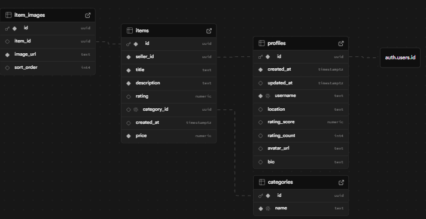
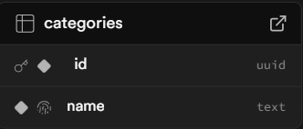
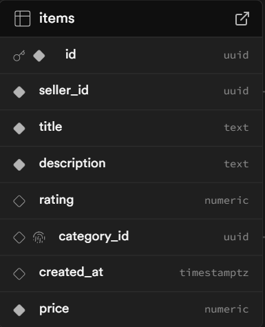
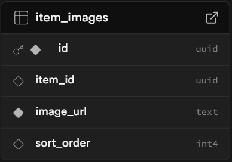
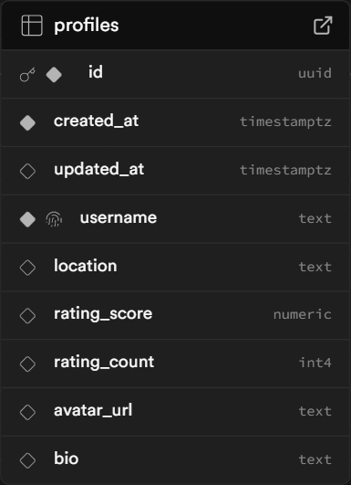

# Supabase database structure




## Categories



- ```id <uuid>``` - unique identifier
- ```name <string>``` - category name

## Items



- ```id <uuid>``` - unique identifier
- ```seller_id <uuid>``` - foreign key for the profiles table
- ```title <string>``` - item name
- ```description <string>``` - item description
- ```rating <float>``` - stars out of 5
- ```category_id <uuid>``` - foreign key for categories table
- ```created_at <string>``` - exact date and time that item was listed
- ```price <float>``` - price of the item (£ default)
- ```condition <string>``` - selling condition of the item

## Item Images



- ```id <uuid>``` - unique identifier
- ```item_id <uuid>``` - foreign key for the items table
- ```image_url <string>``` - url to image held in Supabase item image bucket
- ```sort_order <int>``` - priority of image

## Profiles



- ```id <uuid>``` - unique identifier
- ```created_at <string>``` - exact date and time that profile was created
- ```created_at <string>``` - exact date and time that profile was last updated
- ```username <string>``` - profile name
- ```location <string>``` - location of user
- ```rating_score <float>```  - stars out of 5
- ```rating_count <int>``` - number of people who have reviewed the profile
- ```avatar_url <string>``` - url to image held in Supabase avatar bucket
- ```bio <string>``` - profile bio
- ```postal_code <string>``` - postal code of the profile