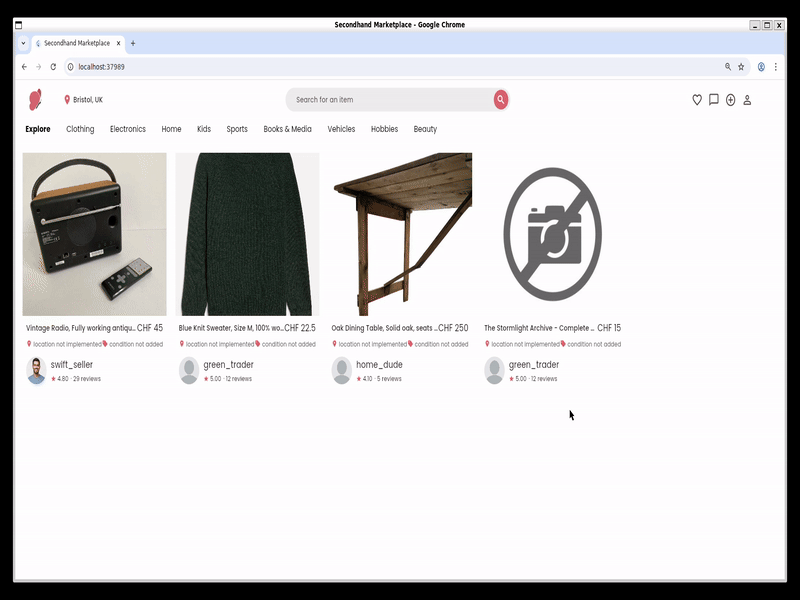
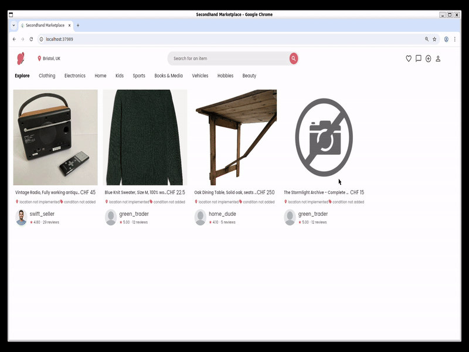

# User instructions

## Getting started

- You will initially be prompted to login to the website - with the option to sign up if you dont have an established account, where you login using your email and password.
- You are then immediately sent to the sites home page, where you may navigate multiple pages, there are also a list of items that you may browse

## To buy items

- To browse or purchase a product from the home page, click on the product you would like to look at to open the "item detail page", where there is a prompt to contact the seller.
- All critical information about quality, price and other details are displayed on the item detail page.

## To sell items

- Click the '+' icon on the header to navigate to the "post item page"
- Fill in the corresponding fields for the item you would like to sell, make sure all details are filled in absolutely correct as first impressions count
- You are able to post your item immediately, or check what it would look like with the draft option

## To view your profile

- Click on the "profile" icon on the header to navigate to your "profile page"
- This page contains information about your account, inclueding items you have listed and your seller rating
- You are also to change your profile information on this screen
