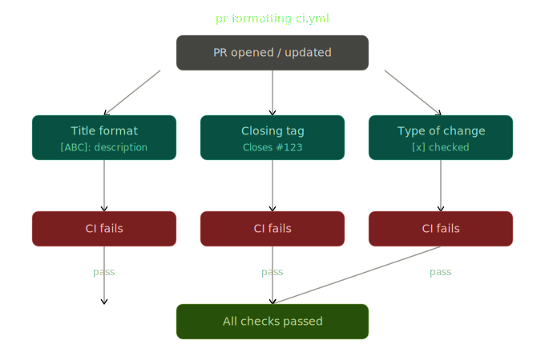
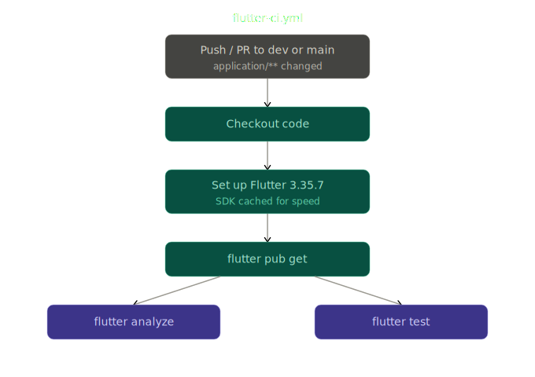
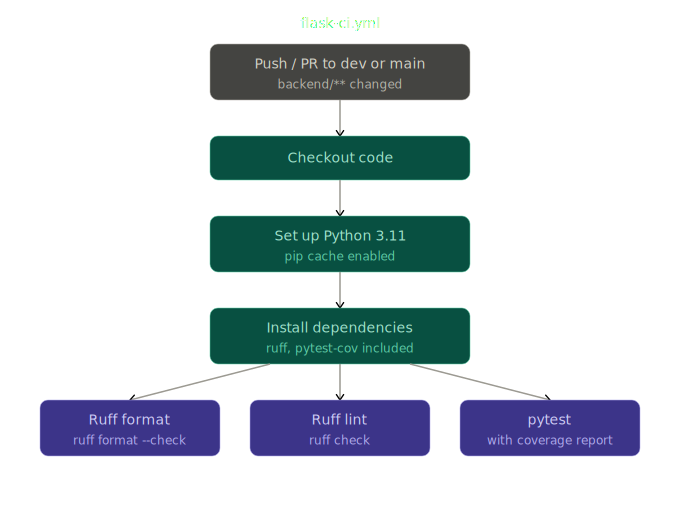
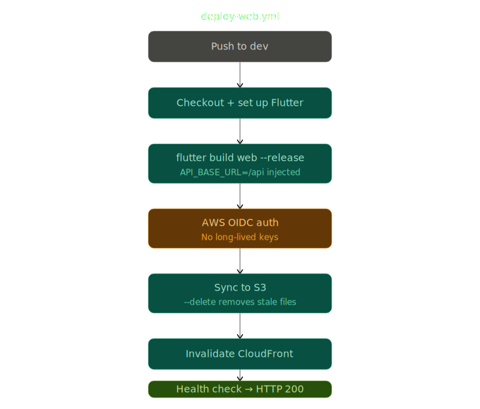
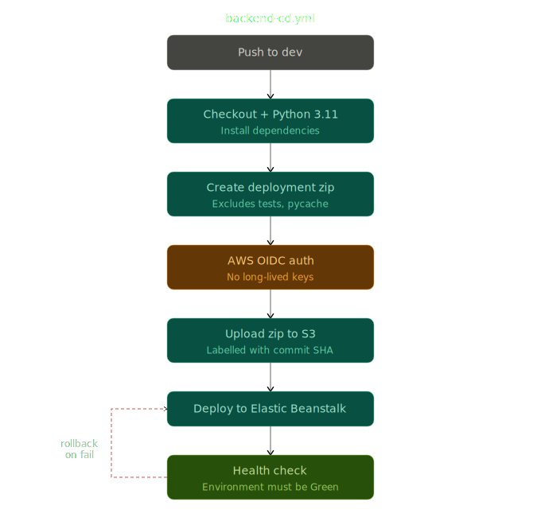

# CI/CD Workflows

This document describes the GitHub Actions workflows used to automate testing, 
deployment, and quality checks for the Secondhand Marketplace project.

---

## Overview

| Workflow | File | Trigger |
|---|---|---|
| PR Formatting Check | `pr-formatting-ci.yml` | Pull request to `dev` |
| Flutter CI | `flutter-ci.yml` | Push/PR to `dev` or `main` |
| Flask CI | `flask-ci.yml` | Push/PR to `dev` or `main` |
| Deploy Web | `deploy-web.yml` | Push to `dev` |
| Backend CD | `backend-cd.yml` | Push to `dev` |
| Publish Docs | `mkdocs-cd.yml` | Push to `dev` or `main` |

---

## Continuous Integration

### PR Formatting Check (`pr-formatting-ci.yml`)

Runs on every pull request opened, edited, or synchronized against `dev`. 
Enforces three rules before a PR can be merged:

**Title format** — PR titles must follow the pattern `[ABC]: Description`, 
for example `[FEAT]: Add search functionality`. The check uses a regex 
`^\[[A-Z]+\]: .+` and fails if the title does not match.

**Closing tag** — The PR body must include a closing reference to an issue, 
such as `Closes #123`, `Fixes #123`, or `Resolves #123`. This ensures every 
PR is linked to a tracked issue.

**Type of change** — The PR body must have at least one type of change 
checkbox ticked (e.g. `[x] Feature`). This is checked by scanning the 
lines following the "Type of Change" header for a checked box.

---

### Flutter CI (`flutter-ci.yml`)

Runs on pushes and pull requests to `dev` or `main` when files inside 
`application/` are changed. Uses Flutter 3.35.7 stable with SDK caching 
enabled to speed up runs.

Steps:
1. Checkout code
2. Set up Flutter with caching
3. Install dependencies (`flutter pub get`)
4. Analyze project (`flutter analyze`)
5. Run tests (`flutter test`)

---

### Flask CI (`flask-ci.yml`)

Runs on pushes and pull requests to `dev` or `main` when files inside 
`backend/` are changed.

Steps:
1. Checkout code
2. Set up Python 3.11 with pip caching
3. Install dependencies including `ruff` and `pytest-cov`
4. Check code formatting with Ruff (`ruff format --check .`)
5. Run linting with Ruff (`ruff check`)
6. Run tests with coverage report (`pytest --cov`)

Supabase credentials are passed in as secrets (`SUPABASE_URL`, `SUPABASE_KEY`) 
during the test step.

---

## Continuous Deployment

### Deploy Web (`deploy-web.yml`)

Triggers on every push to `dev`. Builds the Flutter web app and deploys it 
to AWS S3, then invalidates the CloudFront cache to serve the latest version.

Uses OIDC-based authentication to assume an IAM role — no long-lived AWS 
access keys are stored as secrets.

Steps:
1. Checkout code
2. Set up Flutter
3. Install dependencies
4. Build Flutter web in release mode with `API_BASE_URL` dart-define 
   (defaults to `/api` if not set)
5. Configure AWS credentials via OIDC
6. Sync build output to S3 (`aws s3 sync --delete`)
7. Invalidate CloudFront cache (`/*`)
8. Verify deployment by checking the production URL returns HTTP 200

**Required GitHub variables:**

| Variable | Description |
|---|---|
| `AWS_ROLE_ARN` | IAM role ARN to assume via OIDC |
| `AWS_REGION` | AWS region (e.g. `eu-north-1`) |
| `AWS_S3_BUCKET` | Frontend S3 bucket name |
| `CLOUDFRONT_DISTRIBUTION_ID` | CloudFront distribution ID |
| `CLOUDFRONT_DOMAIN` | Production domain for health check |

**Required GitHub secrets:**

| Secret | Description |
|---|---|
| `API_BASE_URL` | API base URL injected at build time (should be `/api`) |

> [!WARNING]
>
>`API_BASE_URL` must be set to `/api`. Setting it to a direct Elastic Beanstalk URL will bypass CloudFront and cause HTTP/HTTPS errors. See the [CI/CD documentation](../workflows/ci-cd.md) for more details.

---

### Backend CD (`backend-cd.yml`)

Triggers on every push to `dev`. Packages the Flask backend and deploys it 
to AWS Elastic Beanstalk via the AWS CLI.

Uses OIDC-based authentication — no long-lived AWS access keys are stored 
as secrets.

Steps:
1. Checkout code
2. Set up Python 3.11
3. Install dependencies
4. Create deployment package (zip of `backend/`, excluding git files, 
   pycache, and test files)
5. Configure AWS credentials via OIDC
6. Upload zip to S3 backend bucket
7. Create a new Elastic Beanstalk application version
8. Update the EB environment to the new version
9. Wait for the environment to update and verify health is `Green`

If health is not `Green` after deployment, the pipeline fails immediately.

**Required GitHub variables:**

| Variable | Description |
|---|---|
| `AWS_ROLE_ARN` | IAM role ARN to assume via OIDC |
| `AWS_REGION` | AWS region (e.g. `eu-north-1`) |
| `AWS_S3_BUCKET_BACKEND` | S3 bucket for backend deployment packages |

---

## Documentation (`mkdocs-cd.yml`)

Triggers on pushes to `dev` or `main`. Automatically builds and publishes 
the project documentation to GitHub Pages using MkDocs with the Material theme.

Uses `GITHUB_TOKEN` for authentication — no additional secrets required.