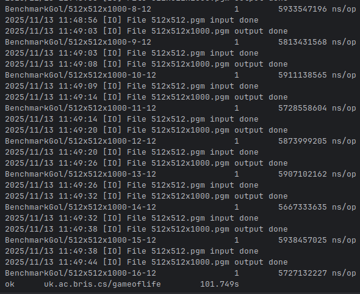

# SecondhandMarketplace(2025)
[](https://dart.dev/)
[](https://flutter.dev/)
[](https://www.python.org/)
[](https://palletsprojects.com/p/flask/)
[](https://aws.amazon.com/)
[](https://supabase.com/)

## Contents
- [Project description](#project-description)
- [Project goals](#project-goals)
- [Project structure](#project-structure)
- [Project setup](#project-setup)
- [Software architecture](#software-architecture)
- [Stakeholders](#stakeholders)
- [User Stories](#user-stories)
- [Project Management](#project-management)
- [Team Members](#team-members)

## Project description 
* **Project name:** Secondhand Marketplace
* **Description:** A Cross-platform secondhand marketplace application built with Flutter, harnessing Python Flask as the backend and using AWS for more backend services such as authentication, databases and cloud hosting.Use Supabase to manage accounts and authentication
* **Tech stack:**
  - Frontend: Flutter
  - Backend: Flask, AWS，Supabase

## Project goals
- Protect the environment since items can be reused and renewed.
- Provide the seller a quick and convenient way to get rid of items they no longer want, for money.
- Provide the buyer a straightforward way to find the articles they desire.

## Project structure
```
2025-SecondhandMarketPlace                    
├── application                     # Holds scripts relating to the Flutter Frontend                    
│   ├── lib
│   │   ├── models                  # Constains data structures that can be reused throughout the frontend
│   │   ├── pages                   # Contains information held on application pages
│   │   ├── services                # Contains files that provide services to other aspects of the frontend
│   │   └── widgets                 # Contains reusable UI elements for the application
|   ├── test                        # Contains tests for the frontend
│   ├── ...
├── backend                         # Holds scripts relating to the Python Flask Backend
│   ├── app
│   │   └── __init__.py             # Creates a blueprint and establishes connection with frontend
│   │   └──  routes.py              # Establishes API endpoints that can connect with the frontend
│   ├── run.py                      # Runs the backend of the application
│   ├── test                        # Contains test files for the backend
│   ├── requirements.txt            # Contains necessary dependencies for the backend
├── docs                            # Contains project information
├── .env.template                   ~ Template for .env file holding API keys
```

## Project setup

#### Prerequisites
- Python 3.10+
- Flutter
- Git

### Guide to setup locally
1. **Clone repository**
```
git clone https://github.com/spe-uob/2025-SecondhandMarketplace.git
```
alternatively through ssh and a secure key setup:
``` 
git clone git@github.com:spe-uob/2025-SecondhandMarketplace.git
```

2. **Initialise virtual environment**

On a Unix based OS (Linux, MacOS, ...):
```
python3 -m venv venv                         # Create a virtual environment
source venv/bin/activate                     # Start up the virtual environment
```
On Windows:
```
python -m venv venv                          # Create a virtual environment
venv/Scripts/Activate.ps1                    # Start up the virtual environment
```

First line is necessary to create the virtual environment, can be reused through the second line afterwards

3. **Set up Flask backend**
```
pip install -r backend/requirements.txt      # Install dependencies
```
Only necessary to run once per virtual environment, or after any project updates

4. **Running the Flask backend**
```
python backend/run.py                        # Run the backend server
```
Only works if in the project root, ```python run.py``` will work if you are already in the backend folder

5. **Set up Flutter frontend**
```
cd application                               # Navigate to the frontend directory
```
Only works if in the project root, ```cd backend/application``` will work if currently in the backend folder
```
flutter pub get                              # Install required packages
```
Only necessary to run once, or after any project updates / ```flutter clean``` commands

6. **Running the Flutter frontend**

make sure you are in the application folder when runnning this command
```
flutter run                                  # Run flutter frontend server
```
you will be prompted to press a key to run on a certain emulator/environment - alternitavely use:
```
flutter run -d [environment name - e.g: chrome]
```

## Software architecture
The following diagram illustrates the Secondhand Marketplace software architecture. It highlights the interaction between the flutter frontend, and the python-flask backend
<p align="left">
  
</p>

## Stakeholders
### End Users:
* #### Buyers
   Buyers are end-users visiting the platform to search for and purchase items. They want products that match their interets with an emphasis on quality, speed of delivery and accurate listings, they will look for these metrics on a user rating system. It is imperitive for these users to have secure payment options and a functioning, easy to use interface.
* #### Sellers
   Sellers are users who list pre-owned goods for sale. They want to be able to easily create and manage listings, while also finding ideal buyers i.e through AI tools to help them along the way. They require payments to be managed efficiently and preferably be able to share location to interested buyers.
* #### Browsers
   Browsers are casual visitors exploring the marketplace without immediate intent to buy or sell, usually to explore items they might want. They contribute to traffic, may become buyers later, and help gauge user interest and trends.

### Core project & Development:
* #### Organisation managers
   Managers oversee day-to-day operations, ensuring the platform runs smoothly and meets strategic goals. It is their role to ensure that operations are running smoothly, and to coordinate between developers and other departments to align with company objectives.
* #### Organisation owners
   Owners are stakeholders or investors who fund and guide the business. They define the company objectives with a focus on profibility and brand growth
* #### Development team
   The development team is responsible for building and maintaining the platform’s technical infrastructure. They handle coding, testing, and ensuring the system is secure, scalable, and user-friendly.
* #### UX development team
   The UX development moreso focuses on developing and accessible and efficient interface thats users can directly interact with. Usually implement designs with user experience in mind through testing and feedback

### Business & Strategy
* #### Marketing team
   The marketing team promotes the platform to garner interest in the brand, the goal to increase the number of buyers and sellers. They manage campaigns, analyze market trends, and build brand awareness to drive user engagement and growth.
* #### Legal team
   The legal team ensures that all marketplace operations comply with laws and regulations. They handle issues like user agreements, intellectual property rights, data protection, and dispute resolution.


## User Stories

## As a **Casual Buyer**
**I want to** browse and search listings easily  
**So that** I can quickly find second-hand items I like without wasting time.

**Pain Points / Problems:**
- Too many irrelevant results when searching  
- Slow or cluttered interfaces in other apps  

**Criteria:**
- Can browse by category (e.g., electronics, fashion, books)  
- Can filter by price range and condition (new/used)  
- Can favorite or save items for later  

---

## As a **First-Time User**
**I want to** explore the app and understand how it works easily  
**So that** I can sell/buy without any confusion.

**Pain Points / Problems:**
- Doesn’t know where to start  
- Too many options on the first screen make it hard to focus  

**Criteria:**
- Clear navigation and tooltips  
- Friendly and immersive design  
- Simple “Buy” vs “Sell” mode selection  

---

## As a **Buyer**
**I want to** see seller reviews and ratings  
**So that** I can make sure I’m buying from a trustworthy person.

**Pain Points / Problems:**
- Fear of scams or poor-quality products  
- Hard to know if a seller is reliable  

**Criteria:**
- Seller rating and review system  
- “Verified Seller” badge for trusted users  

---

## As a **Seller**
**I want to** upload and manage my listings easily from my phone  
**So that** I can sell my used items faster and track interest.

**Pain Points / Problems:**
- Uploading listings takes too long on other platforms  
- Hard to manage listings on mobile  

**Criteria:**
- Can upload photos and details directly from mobile  
- Can edit listings easily  
- Can see the status of my listings at a glance  

---

## As a **Top-Rated Seller**
**I want to** make my shop feel like a small premium boutique  
**So that** customers trust my listings more.

**Pain Points / Problems:**
- Other apps make every seller look the same  
- Hard to build a brand identity  

**Criteria:**
- Customizable profile banner and logo  
- Verified badge + “Top Seller” tag  
- Option to feature listings for extra visibility  

---

## As a **Conscious Consumer**
**I want to** give my unused items a new life  
**So that** I reduce waste and earn something in return.

**Pain Points / Problems:**
- Other marketplaces feel too commercial  
- Lack of community or shared values  

**Criteria:**
- Profile badges for sustainable sellers  
- Monthly “eco impact” summary  
- “Bundle sell” option for related items  


## Project Management
- [Kanban Board](https://github.com/orgs/spe-uob/projects/310/views/1)
- [Gantt Chart](https://github.com/orgs/spe-uob/projects/310/views/2)

## Team Members
| Members          | Email                                                 |
| ---------------- | ----------------------------------------------------- |
| Filip Hrehovcik  | [zu24411@bristol.ac.uk](mailto:zu24411@bristol.ac.uk) |
| Yunbo Zhang      | [th24060@bristol.ac.uk](mailto:th24060@bristol.ac.uk) |
| Emir Gizer       | [nh24391@bristol.ac.uk](mailto:nh24391@bristol.ac.uk) |
| Ewan Friend      | [pu24994@bristol.ac.uk](mailto:pu24994@bristol.ac.uk) |
| Lingze Yuan      | [wp22171@bristol.ac.uk](mailto:wp22171@bristol.ac.uk) |
