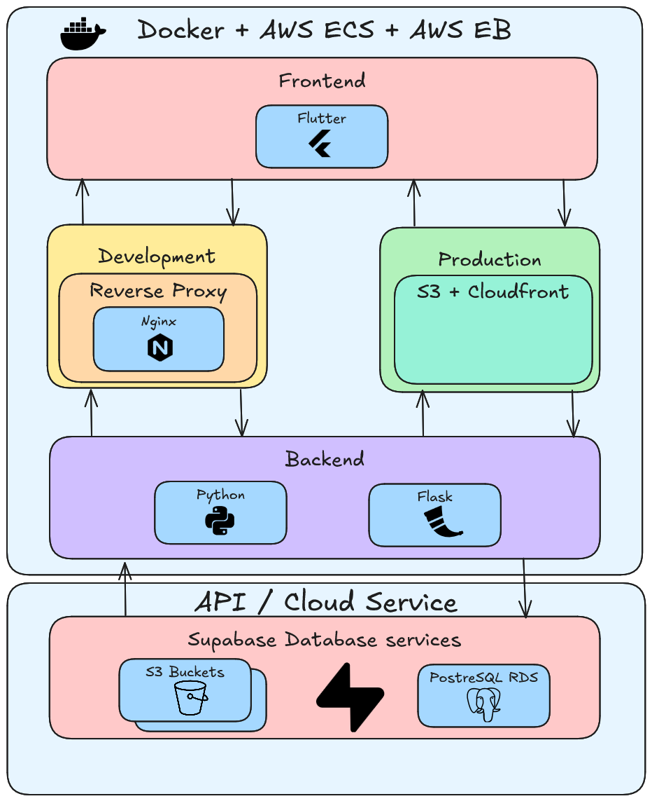

# Secondhand Marketplace Handover

## Contents

- [Secondhand Marketplace Handover](#secondhand-marketplace-handover)
  - [Contents](#contents)
  - [Introduction](#introduction)
  - [Project Setup](#project-setup)
  - [System Architecture](#system-architecture)
  - [API Overview](#api-overview)
  - [Project Structure](#project-structure)
  - [Testing](#testing)
  - [Limitations](#limitations)

## Introduction

This document is designed to give detailed information on certain aspects of the project: If a new developer were to begin working on it. 

The majority of need-to-know, high-level information will be outlined within this document, with more fine grain details being outlined within code comments left throughout the projects codebase.

## Tech Stack

Frontend: Flutter
Backend/API: Flask (Python)
Database: Supabase (PostgreSQL)
Cloud Hosting & Deployment: AWS
Infrastructure & CI/CD: Docker, GitHub Actions

## Project Setup

### Prerequisite Downloads

- [Python 3.xx](https://www.python.org/downloads/) (currently 3.16)
- [Flutter](https://docs.flutter.dev/install)
- [Docker](https://docs.docker.com/engine/install/)

Of course you also need to clone the repository:

- Using **HTTPS URL**:
  - `git clone https://github.com/spe-uob/2025-SecondhandMarketplace.git`

- Using **SSH**:
  - `git clone git@github.com:spe-uob/2025-SecondhandMarketplace.git`

### Setup Development Environment

In order for the project to run, these constants must be declared within a `.env` file in the root directory

```env
SUPABASE_URL= "..." # Supabase project URL, used to connect to the Supabase instance.
SUPABASE_KEY= "..." # Supabase API service role key with elevated privileges
```

>[!WARNING]
>
> `SUPABASE_KEY` must never be exposed in client-side code or commited to the repository.
> Ensure `.env` file is ignored by github

>[!NOTE]
>
> Set `SUPABASE_URL` to be the url of your supabase project [^1]
>
> Set `SUPABASE_KEY` to be the Supabase `service_role` key [^2] 
>
> Frontend does not use any `.env` variables

> [!TIP]
> variable assignment template held in the [`.env.template`](https://github.com/spe-uob/2025-SecondhandMarketplace/blob/dev/.env.template) within the root of the project
>
> Comments within the template tell you what to assign each variable to!

### Backend environment

> [!WARNING]
>
> It is highly recommended that if you are running backend and frontend manually - that you run the backend first
>
> Running the Frontend first is fine for testing UI, however may break functionality

#### Initialise virtual environment

On a Unix based OS (Linux, MacOS, ...):

```bash
python3 -m venv venv                         # Create a virtual environment
source venv/bin/activate                     # Start up the virtual environment
```

On Windows:

```bash
python -m venv venv                                                  # Create a virtual environment
Set-ExecutionPolicy -ExecutionPolicy RemoteSigned -Scope Process     # Allows locally created scripts to run
venv/Scripts/Activate.ps1                                            # Start up the virtual environment
```

#### Install dependancies

```bash
pip install -r backend/requirements.txt      # Install dependencies
```

#### Running using Python

```bash
python backend/run.py                        # Run the backend server
```

> [!NOTE]
>
> The virtual environment and dependencies only need to be set up once
>
> They can be used henceforth, unless dependencies are updated
>
> If that is the case simply run `pip install -r backend/requirements.txt` again

### Frontend environment

**Enter the frontend root**
```bash
cd application                               # Navigate to the frontend directory
```

**Install dependencies**

```
flutter pub get                              # Install required packages
```

> [!NOTE]
> 
> Only necessary to run once, or after any project updates / ```flutter clean``` commands
>
> *make sure to run ```flutter doctor``` to make sure you arent missing any toolchains*

**Running using Flutter**

make sure you are in the application folder when running this command:

```bash
flutter run                                  # Run flutter frontend server
```

you will be prompted to press a key to run on a certain emulator/environment - alternatively use:

```bash
flutter run -d [environment name - e.g: chrome]
```

### Docker Full Stack Setup

> [!NOTE]
>
> This approach should only be ran when in a non-production environment
>
> The primary usage is when you want an image that you can repeatedly run for testing purposes

**Running the application**

```
docker compose up --build     # Builds the projects in a docker container, then launches it
```
>[!TIP]
>
>Container can then be ran within docker desktop (or alternative) for quick access

**Accessing URLS**

- Frontend: http://localhost:8080
- Backend API: http://localhost:5000

### (Optional) MKdocs documentation server

If you want to keep documentation up to date, it is recommended to change the projects' GitHub Pages
server to keep everything adequately documented

**Key configurations**

under `mkdocs.yml`:

- `site_name`: Holds the name of the project
- `repo_url`: Links to Projects GitHub repository
- `markdown_extensions`: Holds any markdown extensions you want added
- `nav`: Holds the documentation table of contents structure

**Running docs server**
>[!NOTE]
>
>This shows how to run on a non-production environment (within the backends virtual environment)
>
>The site is automatically updated when pushing to `dev`/`main` using Actions

```bash
mkdocs serve
```

**Accessing docs URL**

found at http://localhost:8000

**Adding new docs**

- Create new `.md` file under `/docs`
- Add entry to `nav:` in `mkdocs.yml`

## System Architecture

Here is our final architecture diagram for the system



The frontend is developed in Flutter (Dart) and communicates with Flask backend via HTTP requests. The backend provides RESTful API endpoints to handle application logic and data operations. 

Data storage and authentication (partially implemented) are managed by Supabase which provides a PostgreSQL database.
Everything is containerised using Docker to ensure consistency across environments.

GitHub Actions manage continuous integrations (CI) and continuous deployment (CD). 

In development, a reverse proxy (Nginx) is used to route requests between the frontend and backend services.

In production, the frontend is deployed as a static site on an AWS S3 bucket and delivered by CloudFront to improve performance. The backend is deployed on AWS by ECS or Elastic Beanstalk (depending on the environment).

In short, AWS is responsible for hosting and deployment of the application, whereas Supabase provides database and authentication services.

## API Overview

The backend exposes RESTful API used by the Flutter frontend to manage user data, item listings, and gamification features. The API is implemented in Flask and communicates with Supabase to store and query data.

### Base URL

The frontend uses a configurable base URL defined in `app_config.dart`

The value is resolved by this logic and order:

1. If provided via `--dart-define=API_BASE_URL`, that value is used.
2. In local development (web or mobile), the default is: `http://localhost:5000/api`
3. In deployed web environments, a relative path is used (relies on a proxy): `/api`

### Authentication

Authentication is only partially implemented

- Backend routes currently use hardcoded user IDs or mock data
- Supabase has been choosen to provide authentication, but is not yet enforced across endpoints

### Main Endpoints

- `/auth/` routes for authentication (login, sign-up)
- `/status` for checking backend connectivity
- `/items` for retrieving items for listings
- `/profile/<user_id>` and `/me` for user profile retrieval and updates
- `/reviews` for user review retrieval
- `/levels` and `/me/xp` for gamification (level and XP progression)

### Current Implementation Notes

- Responses return JSON with a `status_code` field and either `data`, `table_data`, or `message`
- Some routes currently return mock data rather than actual data from the database (e.g. `/reviews`)

## Project Structure

```txt
.
├── .github
├── application                     # Flutter frontend
├── backend                         # Python Flask backend
├── docs                            # Project docs
├── *root files*                    # Configuration files in the root
```

- [.github](#github)
- [./application](#application)
- [./backend](#backend)
- [./docs](#docs)
- [./*root files*](#root-files)

### ./.github

```txt
.
├── ./ISSUE_TEMPLATE                 # GitHub Issues templates
│   ├── ...
├── ./workflows                      # Workflow files
│   ├── ...
└── ./pull_request_template.md       # GitHub PR template
```

- [./github/ISSUE_TEMPLATE](#githubissue_template)
- [./github/workflows](#githubworkflows)

#### ./.github/ISSUE_TEMPLATE

Currently contains templates for bug reports and general tasks, allows users to fill out the template when starting a new issue.

#### ./.github/workflows

Contains CI and CD workflows, that triggers certain GitHub actions events

- `./workflows/backend-cd.yml`: triggers on pushes to `dev`, deploys the backend to AWS Elastic Beanstalk. Packages the Flask app, Uploading it to S3, updating the environment then verifying the health afterwards
- `./workflows/deploy-web.yml`: triggers on pushes to `dev`, builds the Flutter web app, syncs the release to S3, invalidates CloudFront and then check the deployed site successfully responds
- `./workflows/flask-ci.yml`: triggers on changes made to `./backend` on pushes / pull requests / manual runs. runs the backend CI - including formatting, linting, and generating pytest coverage
- `./workflows/flutter-ci.yml`: triggers on changes made to `./application` on pushes / pull requests / manual runs. runs the frontend CI - fetching dependencies, running `flutter analyze` and executing the test suite.
- `./workflows/mkdocs-cd.yml`: triggers when `dev` or `main` is updated, publishes the project documentation site to GitHub Pages
- `./workflows/pr-formatting-ci.yml`: triggers when a pull request is made to `dev`, enforces PR hygiene by checking title format, requiring a close tag, and ensuring a change type is selected

### ./application

### ./backend

### ./docs

### ./*root files*


## Testing

### Backend Testing

Navigate to the backend directory and run it in the python virtual environment:

```bash
cd backend
```

**Run all tests:**

```bash
pytest -v --cov=app --cov-report=term-missing test/
```

- runs all tests in `test/`
- shows each test result
- reports coverage for `app` (which contains all backend logic)

**Run specific test file:**

```bash
pytest -v test/test_items.py
```

**Run a single test:**

```bash
pytest -v test/test_health.py::test_get_status
```

All tests are automatically run on every push thanks to the `flask-ci.yml` CI workflow

#### Test Coverage

For backend test coverage, from the `backend/` directory with the Python virtual environment activated, run:

```bash
pytest --cov=app --cov-report=term-missing test/
```

This runs all backend tests and prints the overall coverage summary in the terminal, including any missing lines

To generate an interactive and more detailed HTML report, run:

```bash
pytest --cov=app --cov-report=html test/
```

Then open `htmlcov/index.html` in a browser

> [!WARNING]
>
> Make sure that the Python virtual environment is activated before running test commands and that you are in the `backend/` directory
>

### Frontend Testing

Navigate to the frontend directory:

```bash
cd application
```

**Run all tests:**

```bash
flutter test
```

**Run specific test file:**

```bash
flutter test test/post_items_page_test.dart
```

All tests are automatically run on every push thanks to the `flutter-ci.yml` CI workflow

#### Test Coverage

To get the frontend test coverage, run the following from `application/`:

```bash
flutter test --coverage
```

This generates coverage/lcov.info which contains the frontend test coverage data

To view the coverage in an interactive HTML report, run:

```bash
genhtml coverage/lcov.info -o coverage/html
```

Then open `coverage/html/index.html` in a browser

Alternatively view the overall summary in the terminal by running:

```bash
lcov --summary coverage/lcov.info
```

> [!NOTE]
>
> lcov is easy to install on Mac and Linux
>
> - Mac: `brew install lcov` 
> - Linux: `sudo apt-get install lcov`
>
> However when it comes to Windows, we suggest using WSL
> If `genhtml` fails due to Windows-style file paths in `lcov.info`, convert backslashes to forward slashes first: 
> `sed -i 's|\\|/|g' coverage/lcov.info`
> then rerun the command for HTML
>

## Limitations

### Backend

- Authentication is incomplete: missing login endpoint, token validation, email verification, and automatic profile creation on registration 
- Posting an item is tied to a hard-coded testing user, rather than a logged in user (incomplete authentication)
- User information about "Posting for X months" not implemented

### Frontend

- Test coverage is limited, primarily focused on widgets and models, with less coverage of full user flows and integration

### General

- Favourites and Messaging page are not implemented
- Reviews and ratings are hard-coded in the frontend, but the fitting API endpoints are present in the backend

[^1]: An example SUPABASE_URL:  "https://abc123.supabase.co"
[^2]: An example `service_role` key will usually be formatted: "eyJhbGci..." (200-300 characters long)
